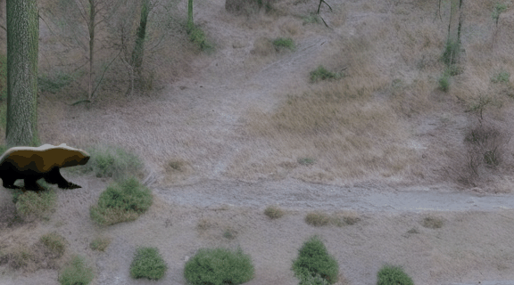

# LLM-grounded Video Diffusion Models
[Long Lian](https://tonylian.com/), [Baifeng Shi](https://bfshi.github.io/), [Adam Yala](https://www.adamyala.org/), [Trevor Darrell](https://people.eecs.berkeley.edu/~trevor/), [Boyi Li](https://sites.google.com/site/boyilics/home) at UC Berkeley/UCSF.

***International Conference on Learning Representations (ICLR) 2024***

[Paper PDF](https://openreview.net/pdf?id=exKHibougU) | [Arxiv](https://arxiv.org/abs/2309.17444) | [Project Page](https://llm-grounded-video-diffusion.github.io/) | [Related Project: LMD](https://llm-grounded-diffusion.github.io/) | [Citation](#citation)

**TL;DR**: Text Prompt -> LLM Spatiotemporal Planner -> Dynamic Scene Layouts (DSLs) -> DSL-grounded Video Generator -> Video. This gives you much better **prompt understanding capabilities** for text-to-video generation.


## Updates
**[2024.4]** From the IGLIGEN project that offers a modern GLIGEN training codebase, several GLIGEN adapters are trained for image and video generation! This can be directly plugged into our DSL-grounded video generator and is compatible with the cross-attention control introduced in our paper. We offer huggingface diffusers integration that works off-the-shelf (**no repo clone or additional packages needed**)! Check out [this demo colab notebook](https://colab.research.google.com/drive/17He4bFAF8lXmT9Nfv-Sg29iKtPelDUNZ) for box-conditioned Modelscope with IGLIGEN adapters. See more details and comparisons for how to use it with this repo [here](#example-videos).

# LLM-grounded Video Diffusion Models (LVD)
The codebase is based on [LLM-grounded Diffusion (LMD)](https://github.com/TonyLianLong/LLM-groundedDiffusion) repo, so please also check out the instructions and FAQs there if your issues are not covered in this repo.

## Installation
Install the dependencies:
```
pip install -r requirements.txt
```

## Stage 1: Generating Dynamic Scene Layouts (DSLs) from text
**Note that we have uploaded the layout caches for the benchmark onto this repo so that you can skip this step if you don't need layouts for new prompts (i.e., just want to use LLM-generated layouts for benchmarking stage 2).**

Since we have cached the layout generation (which will be downloaded when you clone the repo), **you need to remove the cache in `cache` directory if you want to re-generate the layout with the same prompts**.

**Our layout generation format:** The LLM takes in a text prompt describing the image and outputs dynamic scene layouts that consist of three elements: **1.** a reasoning statement for analysis, **2.** a captioned box for each object in each frame, and **3.** a background prompt. The template and example prompts are in [prompt.py](prompt.py). You can edit the template, the example prompts, and the parsing function to ask the LLM to generate additional things or even perform chain-of-thought for better generation.

### Automated query from OpenAI API
Again, if you just want to evaluate stage 2 (layout to video stage), you can skip stage 1 as we have uploaded the layout caches onto this repo. **You don't need an OpenAI API key in stage 2.**

If you have an [OpenAI API key](https://openai.com/blog/openai-api), you can put the API key in `utils/api_key.py` or set `OPENAI_API_KEY` environment variable. Then you can use OpenAI's API for batch text-to-layout generation by querying an LLM, with GPT-4 as an example:
```shell
python prompt_batch.py --prompt-type demo --model gpt-4-1106-preview --auto-query --always-save --template_version v0.1
```
`--prompt-type demo` includes a few prompts for demonstrations. You can change them in [prompt.py](prompt.py). The layout generation will be cached so it does not query the LLM again with the same prompt (lowers the cost).

You can visualize the dynamic scene layouts in the form of bounding boxes in `img_generations/imgs_demo_templatev0.1`. They are saved as `gif` files. For horizontal video generation with zeroscope, the square layout will be scaled according to the video aspect ratio.

### Run our benchmark on text-to-layout generation evaluation
We provide a benchmark that applies both to stage 1 and stage 2. This benchmarks includes a set of prompts with five tasks (numeracy, attribution, visibility, dynamic satial, and sequential) as well as unified benchmarking code for all implemented methods and both stages.

This will generate layouts from the prompts in the benchmark (with `--prompt-type lvd`) and evaluate the results:
```shell
python prompt_batch.py --prompt-type lvd --model gpt-4-1106-preview --auto-query --always-save --template_version v0.1
python scripts/eval_stage_one.py --prompt-type lvd --model gpt-4-1106-preview --template_version v0.1
```
<details>
<summary>Our reference benchmark results (stage 1, evaluating the generated layouts only)</summary>

| Method   | Numeracy | Attribution | Visibility | Dynamics | Sequential | Overall    |
| -------- | -------- | ----------- | ---------- | -------- | ---------- | ---------- |
| GPT-3.5  | 100      | 100         | 100        | 71       | 16         | 77%        |
| GPT-3.5* | 100      | 100         | 100        | 73       | 15         | 78%        |
| GPT-4    | 100      | 100         | 100        | 100      | 88         | **98%**    |

\* The generated cache in this repo comes from this rerun. It differs marginally (1%) from the run that we reported.
</details>

## Stage 2: Generating Videos from Dynamic Scene Layouts
Note that since we provide caches for stage 1, you don't need to run stage 1 on your own for cached prompts that we provide (i.e., you don't need an OpenAI API key or to query an LLM).

Run layout-to-video generation using the gpt-4 cache and **LVD with Zeroscope** (resolution 576x320, 24 frames\*):
```shell
# Zeroscope (horizontal videos)
python generate.py --model gpt-4-1106-preview --run-model lvd_zeroscope --prompt-type demo --save-suffix weak_guidance --template_version v0.1 --seed_offset 0 --repeats 10 --loss_scale 2.5 --loss_threshold 350. --max_iter 1 --max_index_step 10 --fg_top_p 0.25 --bg_top_p 0.25 --fg_weight 1.0 --bg_weight 2.0 --num_frames 24
```

Run video generation with **LVD with Modelscope** (resolution 256x256, 16 frames\*):
```shell
# Modelscope (square videos)
python generate.py --model gpt-4-1106-preview --run-model lvd_modelscope256 --prompt-type demo --save-suffix weak_guidance --template_version v0.1 --seed_offset 0 --repeats 10 --loss_scale 2.5 --loss_threshold 250. --max_iter 1 --max_index_step 10 --fg_top_p 0.25 --bg_top_p 0.25 --fg_weight 1.0 --bg_weight 2.0 --num_frames 16
```

\* For context, [Zeroscope](https://huggingface.co/cerspense/zeroscope_v2_576w) is a model fine-tuned from [Modelscope](https://huggingface.co/ali-vilab/text-to-video-ms-1.7b) that generates horizontal videos without watermark. In contrast, Modelscope generates square videos, and Modelscope's generated videos often come with watermark.

### Update: LVD with GLIGEN adapters for lower inference costs
Similar to LMD+, you can also integrate GLIGEN adapters trained in the [IGLIGEN project](https://github.com/TonyLianLong/igligen) with Modelscope in stage 2. Using GLIGEN adapters on Modelscope **requires less memory and is faster than training-free cross-attention control**. It could run on a T4 GPU on Colab. To use IGLIGEN Modelscope/Zeroscope adapters as our stage 2, you can use this command:
```shell
# Zeroscope (horizontal videos)
python generate.py --model gpt-4-1106-preview --run-model lvd-gligen_zeroscope --prompt-type demo --save-suffix lvd_gligen --template_version v0.1 --seed_offset 0 --repeats 10 --num_frames 24 --gligen_scheduled_sampling_beta 0.4

# Modelscope (square videos)
python generate.py --model gpt-4-1106-preview --run-model lvd-gligen_modelscope256 --prompt-type demo --save-suffix lvd_gligen --template_version v0.1 --seed_offset 0 --repeats 10 --num_frames 16 --gligen_scheduled_sampling_beta 0.4
```

Training-based methods such as GLIGEN typiclly have better spatial control, but sometimes can lead to different interpretations of words w.r.t. the base diffusion model or limited diversity for rare objects. **We recommend trying out both this variant and the original cross-attention-based control variant to get the best of both variants.**

### Baselines
<details>
  <summary>Run baselines to compare the generated video</summary>

Run Zeroscope baseline:
```shell
python generate.py --model gpt-4-1106-preview --run-model zeroscope --prompt-type demo --save-suffix baseline --template_version v0.1 --seed_offset 0 --repeats 10 --num_frames 24
```

Run Modelscope baseline:
```shell
python generate.py --model gpt-4-1106-preview --run-model modelscope_256 --prompt-type demo --save-suffix baseline --template_version v0.1 --seed_offset 0 --repeats 10 --num_frames 16
```
</details>

You can use `--save-suffix` to specify the suffix added to the name of the run. `--run-model` specifies the method to run. You can set to LVD/LVD-GLIGEN or the implemented baselines.

**Note:** there is a tradeoff between the strength of the control and the overall quality of the image with cross-attention control. The commands above with suffix `weak_guidance` trades control strength for lower level of artifacts. See the note in the benchmark section in this README for details.

### Saving formats
The generated videos are saved in `img_generations/imgs_demo_templatev0.1_gpt-4-1106-preview_lvd_zeroscope_weak_guidance` (or other directories in `img_generations` if you run other commands). Note that the script saves the video in two formats: **1.** a `gif` file is saved for each video for quick and easy visualizations and debugging, **2.** a `joblib` file that has the original uncompressed numpy array is saved. **Note that `gif` files only support up to 256 colors, so `joblib` is recommended for future processing/export.** You can easily load with `joblib` and export to `mp4` or do other analysis/visualizations.

### Upsampling to get high-resolution videos
This repo supports both [Zeroscope v2 XL](https://huggingface.co/cerspense/zeroscope_v2_XL) and [Stable Diffusion XL refiner](https://huggingface.co/stabilityai/stable-diffusion-xl-refiner-1.0) upsampling.

Note that SDXL performs upsampling per frame, so it's likely to have some jittering. We recommend using Zeroscope v2 XL upsampler to upsample videos generated by Zeroscope and LVD with Zeroscope.

```shell
python scripts/upsample.py --videos path_to_joblib_video --prompts "prompt for the video" --use_zsxl --horizontal --output-mp4
```

You can use `--output-mp4` to also output `mp4` video. Otherwise only `gif` and `joblib` files will be saved.

### Example videos
Example videos generated with the scripts above with prompt `A bear walking from the left to the right`:
| LVD (Ours, using cross-attention control) | LVD-GLIGEN (using IGLIGEN adapters) | Baseline |
| ---- | -------- | ---- |
|  |  |   |

As you can see, our method leads to improved prompt understanding, while the baseline does not understand "walking from the left to the right" correctly.

### Run our benchmark on layout-to-image generation evaluation
We use a unified evaluation metric as stage 1 in stage 2 (`--prompt-type lvd`). Since we have layout boxes for stage 1 but only images for stage 2, we use OWL-ViT in order to detect the objects and ensure they are generated (or not generated in negation) in the right number, with the right attributes, and in the right place.

This runs generation with LVD and evaluate the generation (resolution 256x256): 
```shell
# Use GPT-4 layouts as an example

## Generation 1
python generate.py --model "gpt-4-1106-preview" --force_run_ind 0 --run-model lvd_modelscope256 --prompt-type lvd --template_version v0.1 --seed_offset 0 --com_loss_scale 0.03
python scripts/eval_owl_vit.py --run_base_path ./img_generations/imgs_lvd_templatev0.1_gpt-4-1106-preview_lvd_modelscope256/run0 --skip_first_prompts 0 --verbose --detection_score_threshold 0.1 --nms_threshold 0.1 --class-aware-nms --num_eval_frames 6 --prompt-type lvd

## Generation 2
python generate.py --model "gpt-4-1106-preview" --force_run_ind 1 --run-model lvd_modelscope256 --prompt-type lvd --template_version v0.1 --seed_offset 500 --com_loss_scale 0.03
python scripts/eval_owl_vit.py --run_base_path ./img_generations/imgs_lvd_templatev0.1_gpt-4-1106-preview_lvd_modelscope256/run1 --skip_first_prompts 0 --verbose --detection_score_threshold 0.1 --nms_threshold 0.1 --class-aware-nms --num_eval_frames 6 --prompt-type lvd
```

Each generation run will lead to 500 videos. Then, please take the average of the two generation runs, **taking 1000 videos into account** (i.e., two videos per generated layout). **The script supports resuming**, and you can simply rerun the same command to resume generation with `--force_run_ind` set (otherwise it will save into a new directory). You can also run these two runs in parallel. Check out `--skip_first_prompts` and `--num_prompts` in [generate.py](generate.py) to parallelize each run across GPUs.

**Note:** there is a tradeoff between the strength of the control and the overall quality of the image with cross-attention control. The hyperparams used in benchmark generation are tuned for the benchmarks, and we observe quality degredation for some of the generated videos, despite with the correct objects generated. We recommend using lower guidance strength for non-benchmarking purpose so that even though some cases the objects may not align closely to the layout, the composition often turns out to be more natural. Similarly, for LVD with IGLIGEN adapters, `gligen_scheduled_sampling_beta` controls the strength of conditioning.

##### Our reference benchmark results
| Method        | Numeracy | Attribution | Visibility | Dynamics | Sequential | Overall    |
| ------------- | -------- | ----------- | ---------- | -------- | ---------- | ---------- |
| ModelScope    | 32       | 54          | 8          | 21       | 0          | 23.0       |
| LVD (GPT-3.5) | 52       | 79          | 64         | 37       | 2          | 46.4%      |
| LVD (GPT-4)   | 41       | 64          | 55         | 51       | 38         | **49.4%**  |

## Contact us
Please contact Long (Tony) Lian if you have any questions: `longlian@berkeley.edu`.

## Acknowledgements
This repo is based on [LMD repo](https://github.com/TonyLianLong/LLM-groundedDiffusion), which is based on [diffusers](https://huggingface.co/docs/diffusers/index) and references [GLIGEN](https://github.com/gligen/GLIGEN), [layout-guidance](https://github.com/silent-chen/layout-guidance). This repo uses the same license as LMD.

## Citation
If you use our work or our implementation in this repo, or find them helpful, please consider giving a citation.
```
@inproceedings{lian2023llmgroundedvideo,
  title={LLM-grounded Video Diffusion Models},
  author={Lian, Long and Shi, Baifeng and Yala, Adam and Darrell, Trevor and Li, Boyi},
  booktitle={The Twelfth International Conference on Learning Representations},
  year={2023}
}

@article{lian2023llmgrounded,
    title={LLM-grounded Diffusion: Enhancing Prompt Understanding of Text-to-Image Diffusion Models with Large Language Models}, 
    author={Lian, Long and Li, Boyi and Yala, Adam and Darrell, Trevor},
    journal={arXiv preprint arXiv:2305.13655},
    year={2023}
}
```
